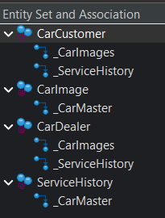

> [!IMPORTANT]
> ### 📺 Quick Project Video Presentation
> **Watch the application walkthrough and feature live-demonstrations on Vimeo:**
> 
> * **[👉 Click here to watch: Car Dealer Application View (Draft-Enabled Pipeline) 👈](https://vimeo.com/1201219246?share=copy&fl=sv&fe=ci)**
> * **[👉 Click here to watch: Car Customer Portal View (Read-Only Catalog) 👈](https://vimeo.com/1201228881?share=copy&fl=sv&fe=ci)**
>

Comprehensive enterprise-grade application built on the **SAP ABAP RESTful Application Programming Model (RAP)**. The project implements a robust transactional backend and exposes tailored User Interfaces using **SAP Fiori Elements** for two distinct business roles: Car Dealers and Retail Customers.

---

## Architecture Overview

The application follows the modern SAP RAP Best Practices, separating the core business logic (Managed Scenario) from the role-specific consumption layer.

```text
               ┌─────────────────────────────────┐
               │    SAP Fiori Elements UI Layer  │
               └────────────────┬────────────────┘
                                │
          ┌─────────────────────┴─────────────────────┐
          ▼                                           ▼
┌───────────────────┐                       ┌───────────────────┐
│ Dealer UI Portal  │                       │Customer UI Portal │
│  (Full CRUD+Draft)│                       │    (Read-Only)    │
└─────────┬─────────┘                       └─────────┬─────────┘
          │                                           │
          ▼                                           ▼
┌───────────────────┐                       ┌───────────────────┐
│  ZC_CAR_MASTER    │                       │  ZC_CAR_CUSTOMER  │
│  Projection View  │                       │  Projection View  │
└─────────┬─────────┘                       └─────────┬─────────┘
          │                                           │
          └─────────────────────┬─────────────────────┘
                                │ (Redirection)
                                ▼
                    ┌───────────────────────┐
                    │     ZR_CAR_MASTER     │
                    │   Core Business Obj.  │
                    └───────────┬───────────┘
                                │
        ┌───────────────────────┼───────────────────────┐
        ▼                       ▼                       ▼
┌───────────────┐       ┌───────────────┐       ┌───────────────┐
│ zcar_master   │       │ zcar_images   │       │ zcar_service  │
│ (Core Vehicle)│       │ (Attachments) │       │ (1:N History) │
└───────────────┘       └───────────────┘       └───────────────┘
```
## Business Object Hierarchy & Data Model
The backend business service exposes a multi-level entity composition tree structured to support transactional processes and seamless data navigation.



### Key Architectural Components:
* **Root Projections (`CarDealer` / `CarCustomer`):** Tailored service entry points. `CarDealer` provides a full transaction pipeline equipped with draft capabilities, while `CarCustomer` acts as an optimized, consumer-facing read-only endpoint.
* **Vehicle Image Gallery (`_CarImages`):** Sub-node handling binary data streams (`RAWSTRING`) for car logotypes and vehicle gallery photos with fully automated background MIME-type mappings.
* **Service History (`_ServiceHistory`):** Hierarchical 1:N operational child node detailing comprehensive service, repairs, and financial logs for each vehicle instance.

---

## Project Structure & ABAP Repository Layout

The development artifacts are strictly organized according to the **SAP Virtual Data Model (VDM)** best practices, ensuring a clean separation of concerns between core data provisioning and exposure layers.

### Data Definitions (CDS Views)

| Artifact Name | Layer | Description |
| :--- | :--- | :--- |
| **`ZR_CAR_MASTER`** | Core / Base | Core Business Object view entity for the vehicle master data (Root node). |
| **`ZR_CAR_IMAGES`** | Core / Base | Base view entity managing attachment links and large media objects (Child node). |
| **`ZR_CAR_SERVICE`** | Core / Base | Base view entity for vehicle operational and repair history logs (Child node). |
| **`ZC_CAR_MASTER`** | Projection | Transactional projection view optimized for the Car Dealer application interface. |
| **`ZC_CAR_CUSTOMER`**| Projection | Consumer projection view configured specifically as a read-only portal for Customers. |
| **`ZC_CAR_IMAGES`** | Projection | Role-specific projection view exposing car images child node compositions. |
| **`ZC_CAR_SERVICE`** | Projection | Role-specific projection view exposing service history child node compositions. |
| **`ZCAR_BODY_VH`** | Value Help  | Dedicated Value Help definition supplying data for Car Body Types dropdown fields. |
| **`ZCAR_STATUS_VH`** | Value Help  | Dedicated Value Help definition supplying data for Transactional Statuses dropdown fields. |

### Metadata Extensions (MDE)

UI annotations are fully decoupled from data provisioning layers and isolated inside specific extensions to drive the SAP Fiori Elements frontend dynamically:

* **`ZC_CAR_MASTER`** – Defines layouts, facets, selection fields, and custom actions for the Dealer UI.
* **`ZC_CAR_CUSTOMER`** – Controls the read-only card grids and details view exposed to retail clients.
* **`ZC_CAR_IMAGES`** – Controls the presentation layout of the media attachment gallery and input fields.
* **`ZC_CAR_SERVICE`** – Organizes responsive table listings for maintenance timelines and historical cost metrics.

---

## Key Technical Implementations

* **Draft-Enabled Capabilities:** Bulletproof session state management preventing data loss during multi-stage vehicle edits, handled natively via the RAP framework.
* **Custom Field Formatting & Semantics:** Dynamic status criticalities (color-coded markers based on state), clean text arrangement formatting, and seamless currency lookups for financial logs.
* **Large Object Media Processing:** Enterprise attachment handling mapping automated MIME streams (`RAWSTRING`) directly via database tables without hardcoded UI parameters.

---

## Deployment & Usage

1. **Backend:** Import the repository into your ABAP Development Tools (ADT) in Eclipse.
2. **Service Definition:** Activate the Service Definition and bind it to a **OData V4 UI Service** (`UI_CAR_DEALER_V4` / `UI_CAR_CUSTOMER_V4`).
3. **Frontend:** Run via SAP Fiori Elements preview to explore the draft-enabled dealer pipeline or customer catalog.
